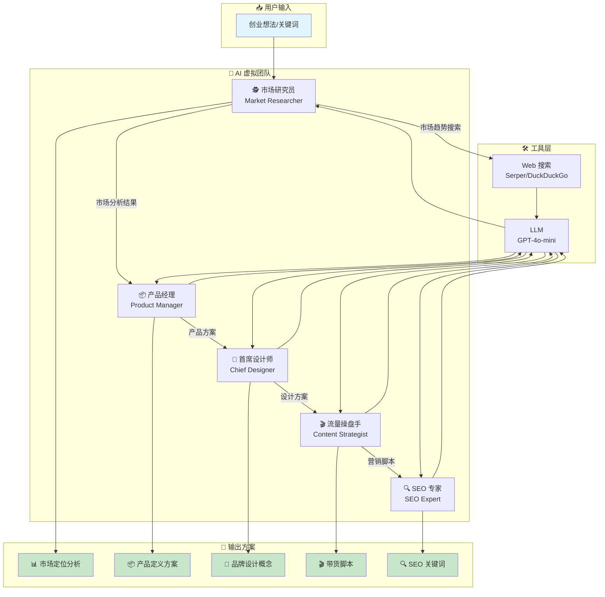
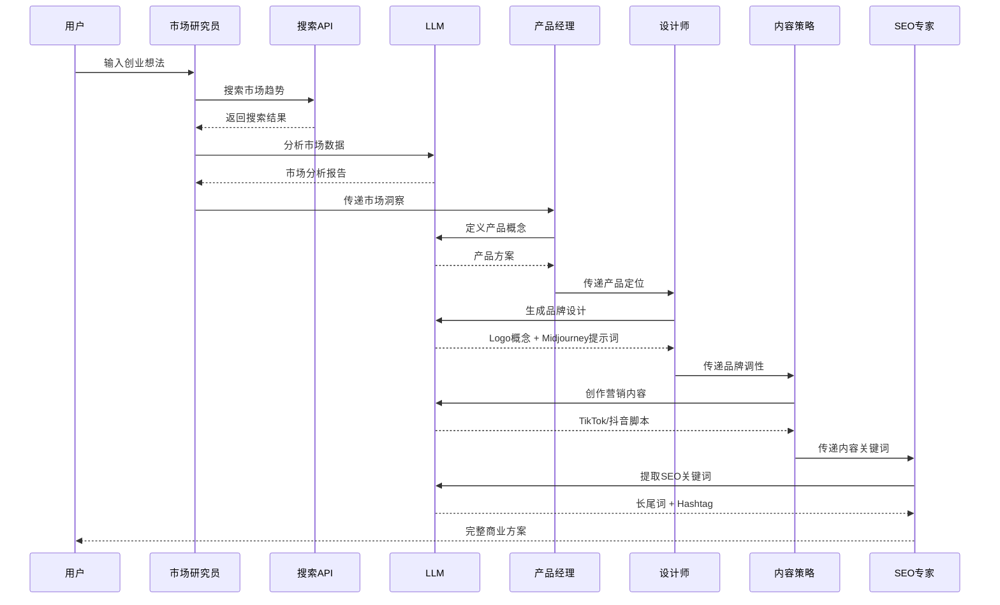

# 🚀 BizGenesis - AI 创业辅助系统

让 AI 团队帮你从想法到完整商业方案！

## 📊 系统流程图



## 🔄 数据流程



## ✨ 功能

| Agent | 角色 | 输出 |
|-------|------|------|
| 🕵️ 市场研究员 | 分析市场趋势，找到细分利基 | 市场定位分析 |
| 📦 产品经理 | 打造差异化产品概念 | 产品定义方案 |
| 🎨 首席设计师 | 生成 Logo 概念 | 品牌设计 + Midjourney Prompt |
| 🎬 流量操盘手 | 写爆款带货脚本 | TikTok/抖音脚本 |
| 🔍 SEO 专家 | 挖掘高转化关键词 | 长尾词 + Hashtag |

## 🛠️ 快速开始

### 方式 1: 命令行

```bash
# 1. 安装依赖
pip install -r requirements.txt

# 2. 配置环境变量
cp .env.example .env
# 编辑 .env 文件，填入你的 OPENAI_API_KEY

# 3. 运行
python -m src.main
```

### 方式 2: Web UI (Streamlit)

```bash
# 安装依赖后运行
streamlit run src/ui/app.py
```

### 方式 3: Docker

```bash
# 构建并运行
docker-compose up --build

# 访问 http://localhost:8501
```

## 📁 项目结构

```
BizGenesis/
├── src/
│   ├── main.py          # CLI 入口
│   ├── config.py        # 配置管理
│   ├── models.py        # Pydantic 模型
│   ├── agents/          # AI Agent 实现
│   │   ├── base.py      # 基类（日志、重试、记忆）
│   │   ├── market.py    # 市场研究员
│   │   ├── product.py   # 产品经理
│   │   ├── designer.py  # 首席设计
│   │   ├── marketing.py # 流量操盘手
│   │   └── seo.py       # SEO 专家
│   ├── tools/           # 工具模块
│   │   ├── search.py    # 搜索工具
│   │   └── calculator.py
│   └── ui/              # Streamlit UI
│       └── app.py
├── requirements.txt
├── Dockerfile
├── docker-compose.yml
└── README.md
```

## 🔑 环境变量

| 变量             | 必填 | 说明                        |
| ---------------- | ---- | --------------------------- |
| OPENAI_API_KEY   | ✅   | OpenAI API Key              |
| OPENAI_MODEL     | ❌   | 模型名称，默认 gpt-4o-mini  |
| SERPER_API_KEY   | ❌   | Serper API Key（可选搜索）   |

## 🌐 搜索 API

默认使用 **DuckDuckGo** 免费搜索。配置 SERPER_API_KEY 可使用 Google 搜索，更快更准。

获取 Serper API Key: https://serper.dev/

## 📝 使用示例

```
输入: 猫粮

输出:
📊 市场定位: 高端无谷猫粮细分市场
📦 产品定义: "喵星优选" - 订阅制个性化猫粮
🎨 品牌设计: Logo 概念 + Midjourney Prompt
🎬 流量脚本: TikTok 3秒黄金开场脚本
🔍 SEO 策略: 长尾关键词 + Hashtag 推荐
```

## 🛡️ 技术栈

- **LangChain** - LLM 编排框架
- **Streamlit** - Web UI
- **Pydantic** - 数据验证
- **Loguru** - 日志系统
- **Tenacity** - 重试机制

## 📄 License

MIT License

## 🤝 贡献

欢迎 PR 和 Issue！
