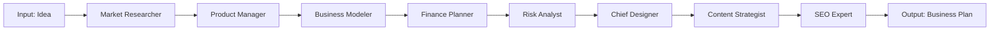
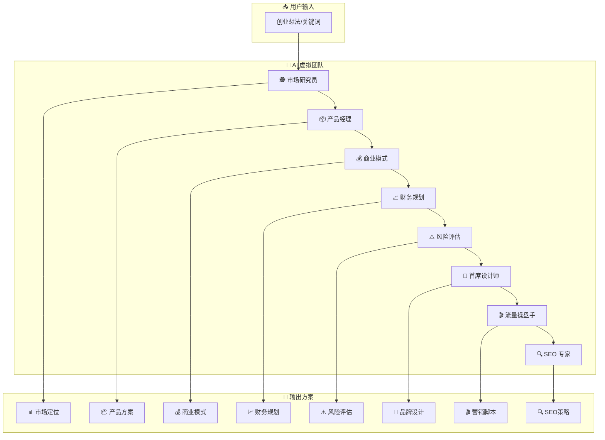

# 🚀 BizGenesis - AI Startup Assistant | AI 创业辅助系统

[English](#english) | [中文](#中文)

---

<a name="english"></a>
## English

### 📖 Overview

BizGenesis is an AI-powered startup assistant that transforms your business idea into a complete business plan. Our virtual AI team collaborates to deliver:

- 🕵️ **Market Research** - Analyze trends, identify niche opportunities
- 📦 **Product Definition** - Create differentiated product concepts
- 💰 **Business Model** - Design monetization strategy and pricing
- 📈 **Finance Planning** - Startup budget and cash flow forecast
- ⚠️ **Risk Analysis** - Identify threats and mitigation strategies
- 🎨 **Brand Design** - Generate logo concepts & Midjourney prompts
- 🎬 **Content Strategy** - Write viral TikTok/Douyin scripts
- 🔍 **SEO Strategy** - Extract high-conversion keywords

### 📊 System Architecture



### 🛠️ Quick Start

```bash
# 1. Clone & Setup
git clone https://github.com/reedtang666/BizGenesis.git
cd BizGenesis

# 2. Create virtual environment
python3 -m venv venv
source venv/bin/activate

# 3. Install dependencies
pip install -r requirements.txt

# 4. Configure .env
cp .env.example .env
# Edit .env with your API keys

# 5. Run
python -m src.main
```

### 🔑 Configuration

| Variable | Required | Description |
|----------|----------|-------------|
| `LLM_PROVIDER` | No | Provider: `openai`, `qwen`, `zhipu`, `deepseek` |
| `QWEN_API_KEY` | If using Qwen | Qwen API Key |
| `ZHIPU_API_KEY` | If using GLM | Zhipu AI API Key |
| `OPENAI_API_KEY` | If using OpenAI | OpenAI API Key |

### 🌐 Web UI

```bash
streamlit run src/ui/app.py
```

### 🐳 Docker

```bash
docker-compose up --build
```

---

<a name="中文"></a>
## 中文

### 📖 项目简介

BizGenesis 是一个 AI 创业辅助系统，让你的创业想法变成完整的商业方案。虚拟 AI 团队协同工作：

- 🕵️ **市场研究员** - 分析市场趋势，找到细分利基
- 📦 **产品经理** - 打造差异化产品概念
- 💰 **商业模式** - 设计变现策略和定价方案
- 📈 **财务规划** - 启动资金预算和现金流预测
- ⚠️ **风险评估** - 识别威胁和应对策略
- 🎨 **首席设计师** - 生成 Logo 概念和 Midjourney Prompt
- 🎬 **流量操盘手** - 写 TikTok/抖音爆款带货脚本
- 🔍 **SEO 专家** - 挖掘高转化长尾关键词

### 📊 系统流程图



### 🛠️ 快速开始

```bash
# 1. 克隆项目
git clone https://github.com/reedtang666/BizGenesis.git
cd BizGenesis

# 2. 创建虚拟环境
python3 -m venv venv
source venv/bin/activate

# 3. 安装依赖
pip install -r requirements.txt

# 4. 配置 .env
cp .env.example .env
# 编辑 .env 填入你的 API Key

# 5. 运行
python -m src.main
```

### 🔑 配置说明

| 变量 | 必填 | 说明 |
|------|------|------|
| `LLM_PROVIDER` | 否 | 模型提供商: `openai`, `qwen`, `zhipu`, `deepseek` |
| `QWEN_API_KEY` | 用千问时 | 千问百炼 API Key |
| `ZHIPU_API_KEY` | 用智谱时 | 智谱 AI API Key |
| `OPENAI_API_KEY` | 用 OpenAI 时 | OpenAI API Key |

### 🌐 Web UI

```bash
streamlit run src/ui/app.py
```

### 🐳 Docker 部署

```bash
docker-compose up --build
```

### 📁 项目结构

```
BizGenesis/
├── src/
│   ├── main.py          # CLI 入口
│   ├── config.py        # 配置管理
│   ├── models.py        # Pydantic 模型
│   ├── agents/          # AI Agent
│   │   ├── base.py      # 基类
│   │   ├── market.py    # 市场研究员
│   │   ├── product.py   # 产品经理
│   │   ├── business.py  # 商业模式
│   │   ├── finance.py   # 财务规划
│   │   ├── risk.py      # 风险评估
│   │   ├── designer.py  # 首席设计
│   │   ├── marketing.py # 流量操盘手
│   │   └── seo.py       # SEO 专家
│   ├── tools/           # 工具模块
│   │   ├── search.py    # 搜索工具
│   │   └── calculator.py
│   └── ui/              # Web UI
│       └── app.py
├── output/              # 生成的方案文件
├── requirements.txt
├── Dockerfile
└── docker-compose.yml
```

### 🛡️ 技术栈

- **LangChain** - LLM 编排框架
- **Streamlit** - Web UI
- **Pydantic** - 数据验证
- **Loguru** - 日志系统
- **Tenacity** - 重试机制

### 📄 License

MIT License

---

## ⭐ Star History

如果这个项目对你有帮助，请给个 Star ⭐
