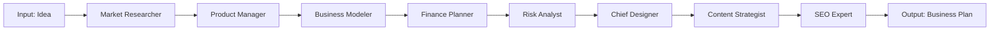
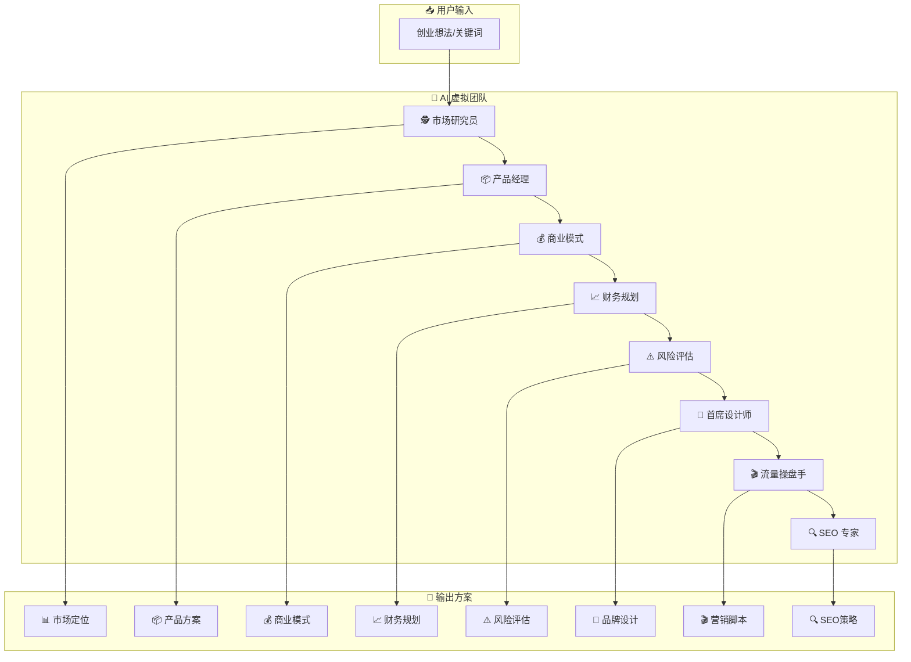

# 🚀 BizGenesis - AI Startup Assistant | AI 创业辅助系统

[English](#english) | [中文](#中文)

---

<a name="english"></a>
## English

### 📖 Overview

BizGenesis is an AI-powered startup assistant that transforms your business idea into a complete business plan. Our virtual AI team collaborates to deliver professional business analysis with real-time cost tracking, parallel execution, and beautiful export options.

### ✨ Features

**Core AI Team (8 Agents):**
- 🕵️ **Market Research** - Analyze trends with real competitor data
- 📦 **Product Definition** - Create differentiated product concepts
- 💰 **Business Model** - Design monetization strategy and pricing
- 📈 **Finance Planning** - Startup budget and cash flow forecast
- ⚠️ **Risk Analysis** - Identify threats and mitigation strategies
- 🎨 **Brand Design** - Generate logo concepts & Midjourney prompts
- 🎬 **Content Strategy** - Write viral TikTok/Douyin scripts
- 🔍 **SEO Strategy** - Extract high-conversion keywords

**Enhanced Capabilities:**
- ⚡ **Parallel Execution** - Run independent agents simultaneously (30-50% faster)
- 💰 **Token Cost Tracking** - Real-time monitoring of API usage and costs
- 🔍 **Competitor Data** - Real web search integration for market analysis
- 🛡️ **Error Degradation** - Graceful fallback when agents fail
- 📄 **PDF Export** - Beautiful PDF generation with custom styling
- 📊 **A/B Testing** - Prompt variant testing and optimization
- 🧪 **Full Test Coverage** - 135+ tests with 87% coverage

### 📊 System Architecture



### 🛠️ Quick Start

```bash
# 1. Clone & Setup
git clone https://github.com/reedtang666/BizGenesis.git
cd BizGenesis

# 2. Create virtual environment
python3 -m venv venv
source venv/bin/activate

# 3. Install dependencies
pip install -r requirements.txt

# 4. Configure .env
cp .env.example .env
# Edit .env with your API keys

# 5. Run CLI
python -m src.main

# 6. Or run Web UI
streamlit run src/ui/app.py
```

### 🔑 Configuration

| Variable | Required | Description |
|----------|----------|-------------|
| `LLM_PROVIDER` | No | Provider: `openai`, `qwen`, `zhipu`, `deepseek` |
| `QWEN_API_KEY` | If using Qwen | Qwen API Key |
| `ZHIPU_API_KEY` | If using GLM | Zhipu AI API Key |
| `OPENAI_API_KEY` | If using OpenAI | OpenAI API Key |
| `SERPER_API_KEY` | No | Serper.dev API for better search (optional) |
| `TOKEN_MONTHLY_BUDGET` | No | Monthly token budget limit (optional) |

### 🌐 Web UI

Modern, responsive web interface with:
- ⚡ Toggle parallel execution
- 💰 Real-time token usage display
- 📊 Progress tracking for each agent
- 📄 One-click PDF export

```bash
streamlit run src/ui/app.py
```

### 🐳 Docker

```bash
docker-compose up --build
```

---

<a name="中文"></a>
## 中文

### 📖 项目简介

BizGenesis 是一个 AI 驱动的创业辅助系统，将你的创业想法转化为完整的商业方案。8 个 AI Agent 智能协作，提供专业的市场分析、产品规划、商业模式设计等服务，支持并行执行、成本监控和美观的导出功能。

### ✨ 功能特性

**核心 AI 团队（8 个 Agent）：**
- 🕵️ **市场研究员** - 结合真实竞品数据的市场分析
- 📦 **产品经理** - 打造差异化产品概念
- 💰 **商业模式** - 设计变现策略和定价方案
- 📈 **财务规划** - 启动资金预算和现金流预测
- ⚠️ **风险评估** - 识别威胁和应对策略
- 🎨 **首席设计师** - 生成 Logo 概念和 Midjourney Prompt
- 🎬 **流量操盘手** - 写 TikTok/抖音爆款带货脚本
- 🔍 **SEO 专家** - 挖掘高转化长尾关键词

**增强功能：**
- ⚡ **并行执行** - 智能识别可并行任务，执行速度提升 30-50%
- 💰 **Token 成本监控** - 实时追踪 API 调用消耗和费用
- 🔍 **竞品数据接入** - 真实网络搜索获取竞品信息
- 🛡️ **错误降级** - Agent 失败时自动使用默认响应，流程不中断
- 📄 **PDF 导出** - 美观的 PDF 生成，支持自定义样式
- 📊 **Prompt A/B 测试** - 多版本 Prompt 测试和优化
- 🧪 **完整测试覆盖** - 135+ 单元测试，87% 代码覆盖率

### 📊 系统流程图



### 🔄 并行执行优化

系统智能识别无依赖的 Agent，实现并行执行：

```
批次 1: [市场研究 + 品牌设计 + SEO]     ← 并行执行
批次 2: [产品定义]                      ← 依赖批次 1
批次 3: [商业模式]                      ← 依赖批次 2  
批次 4: [财务规划 + 流量脚本]           ← 并行执行
批次 5: [风险评估]                      ← 依赖批次 3+4
```

**性能提升：** 启用并行执行后，总耗时从 ~8-10 分钟缩短至 ~5-6 分钟（提升 30-50%）

### 🛠️ 快速开始

```bash
# 1. 克隆项目
git clone https://github.com/reedtang666/BizGenesis.git
cd BizGenesis

# 2. 创建虚拟环境
python3 -m venv venv
source venv/bin/activate

# 3. 安装依赖
pip install -r requirements.txt

# 4. 配置 .env
cp .env.example .env
# 编辑 .env 填入你的 API Key

# 5. 运行 CLI
python -m src.main

# 6. 或运行 Web UI
streamlit run src/ui/app.py
```

### 🔑 配置说明

| 变量 | 必填 | 说明 |
|------|------|------|
| `LLM_PROVIDER` | 否 | 模型提供商: `openai`, `qwen`, `zhipu`, `deepseek` |
| `QWEN_API_KEY` | 用千问时 | 千问百炼 API Key |
| `ZHIPU_API_KEY` | 用智谱时 | 智谱 AI API Key |
| `OPENAI_API_KEY` | 用 OpenAI 时 | OpenAI API Key |
| `SERPER_API_KEY` | 否 | Serper.dev 搜索 API（可选，提升搜索质量） |
| `TOKEN_MONTHLY_BUDGET` | 否 | Token 月度预算上限（可选） |

### 🌐 Web UI

现代化响应式界面，包含：
- ⚡ 并行执行开关
- 💰 实时 Token 使用统计
- 📊 每个 Agent 的执行进度
- 📄 一键 PDF 导出

```bash
streamlit run src/ui/app.py
```

界面预览：
- 渐变背景设计
- 功能特性展示卡片
- 执行流程可视化
- 结果标签页展示

### 🐳 Docker 部署

```bash
docker-compose up --build
```

### 📁 项目结构

```
BizGenesis/
├── src/
│   ├── main.py              # CLI 入口（支持并行执行）
│   ├── config.py            # 配置管理
│   ├── models.py            # Pydantic 模型
│   ├── exceptions.py        # 共享异常类
│   ├── agents/              # AI Agent
│   │   ├── base.py          # 基类（集成 Token 监控、错误降级）
│   │   ├── market.py        # 市场研究员（含竞品数据）
│   │   ├── product.py       # 产品经理
│   │   ├── business.py      # 商业模式
│   │   ├── finance.py       # 财务规划
│   │   ├── risk.py          # 风险评估
│   │   ├── designer.py      # 首席设计
│   │   ├── marketing.py     # 流量操盘手
│   │   └── seo.py           # SEO 专家
│   ├── utils/               # 工具模块 ⭐ 新增
│   │   ├── token_monitor.py     # Token 成本监控
│   │   ├── error_degradation.py # 错误降级处理
│   │   ├── competitor_data.py   # 竞品数据收集
│   │   ├── agent_parallel.py    # Agent 并行执行
│   │   ├── pdf_export.py        # PDF 导出
│   │   ├── json_output.py       # JSON 结构化输出
│   │   └── prompt_ab_test.py    # Prompt A/B 测试
│   ├── tools/               # 基础工具
│   │   ├── search.py        # 搜索工具
│   │   └── calculator.py
│   └── ui/                  # Web UI ⭐ 全新设计
│       └── app.py           # Streamlit 界面
├── tests/                   # 测试套件 ⭐ 新增
│   ├── conftest.py          # Pytest 配置
│   ├── test_token_monitor.py
│   ├── test_error_degradation.py
│   ├── test_competitor_data.py
│   ├── test_agent_parallel.py
│   ├── test_pdf_export.py
│   ├── test_json_output.py
│   ├── test_prompt_ab_test.py
│   └── test_base_agent_integration.py
├── output/                  # 生成的方案文件
├── requirements.txt
├── pytest.ini               # Pytest 配置
├── Dockerfile
└── docker-compose.yml
```

### 🛡️ 技术栈

**核心框架：**
- **LangChain** - LLM 编排框架
- **Streamlit** - Web UI（现代化响应式设计）
- **Pydantic** - 数据验证
- **Loguru** - 日志系统
- **Tenacity** - 重试机制

**新增依赖：**
- **reportlab** - PDF 生成
- **pytest** + **pytest-cov** - 测试框架和覆盖率
- **duckduckgo-search** - 网络搜索

### 🧪 测试

项目包含完整的测试套件，覆盖率 87%：

```bash
# 运行所有测试
python -m pytest tests/ -v

# 运行测试并查看覆盖率
python -m pytest tests/ --cov=src/utils --cov-report=term

# 运行特定测试文件
python -m pytest tests/test_token_monitor.py -v
```

**测试统计：**
- 135+ 测试用例
- 87% 代码覆盖率
- 所有核心功能均有单元测试覆盖

### 📊 Token 成本监控

系统实时追踪每个 Agent 的 Token 消耗：

```python
# 配置月度预算（可选）
TOKEN_MONTHLY_BUDGET=1000000

# 查看使用统计
monitor = get_token_monitor()
summary = monitor.get_usage_summary()
# {
#     "total_tokens": 15000,
#     "total_cost": 0.15,
#     "by_agent": {...},
#     "budget": {"limit": 1000000, "remaining": 998500}
# }
```

### 📄 导出格式

支持两种导出格式：

1. **Markdown** - 保留原始格式，便于编辑
2. **PDF** - 美观排版，适合分享和打印

### 📄 License

MIT License

---

## ⭐ Star History

如果这个项目对你有帮助，请给个 Star ⭐

## 📝 Changelog

### v2.0.0 (2024-04)
- ✅ 新增并行执行功能，性能提升 30-50%
- ✅ 新增 Token 成本监控和预算管理
- ✅ 新增竞品数据自动收集
- ✅ 新增错误降级机制
- ✅ 新增 PDF 导出功能
- ✅ 新增 Prompt A/B 测试框架
- ✅ 新增 JSON 结构化输出
- ✅ 全新设计的 Web UI
- ✅ 135+ 单元测试，87% 覆盖率
